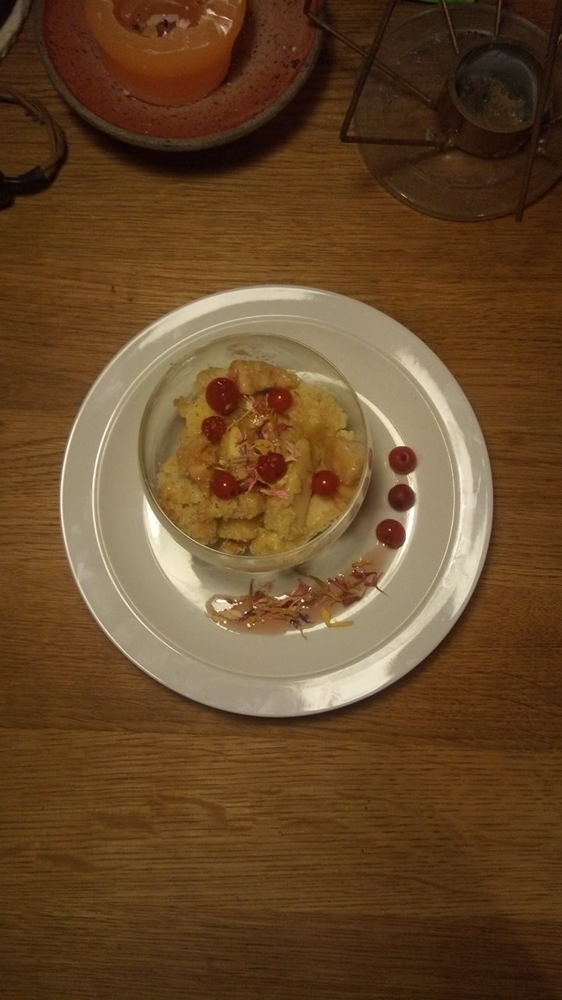

# emmanota
Projet cuisine code
<!DOCTYPE html>
<html>
	<head>
		<meta charset="utf-8">
		<title>recette</title>
		<link href="style.css" rel="stylesheet">
	   <link href="https://fonts.googleapis.com/css?family=Roboto" rel="stylesheet">
		
	</head>
	<body>
		

           
	    

 		   

			   <h1 class="titre">Crumbule</h1>
               <h2 class="soustitre">Préparation</h2>

			<h3>Étape 1</h3>
			
Préchauffer le four à 180°C (thermostat 6). Peler les pommes.

			<h3>Étape 2</h3>
			
Couper les pommes en dés.

			<h3>Étape 3</h3>
			
Dans un saladier, mélanger la farine au sucre,

			<h3>Étape 4</h3>
			
puis au beurre

			<h3>Étape 5</h3>
			
Malaxer le tout avec les doigts pour obtenir une pâte sableuse.

			<h3>Étape 6</h3>
			
Beurrer le moule, y disposer les pommes tranchées (ou les poires) et placer la pâte par dessus.

			<h3>Étape 7</h3>
			
Laisser cuire 25 min. Servir avec une crème anglaise.

			
TEMPS TOTAL : 35 MIN
				Préparation : 10 min
				Cuisson : 25 min
			

			

		   

			   <h2>Ingrédients</h2>

		<ul>
			<li>3 pommes (ou 3 poires)</li>
			<li>150 g de farine
</li>
			<li>75 g de beurre</li>
			<li>120 g de sucre</li>
			<li>1 pincée de sel</li>
		</ul>

          

	</body>
</html>
